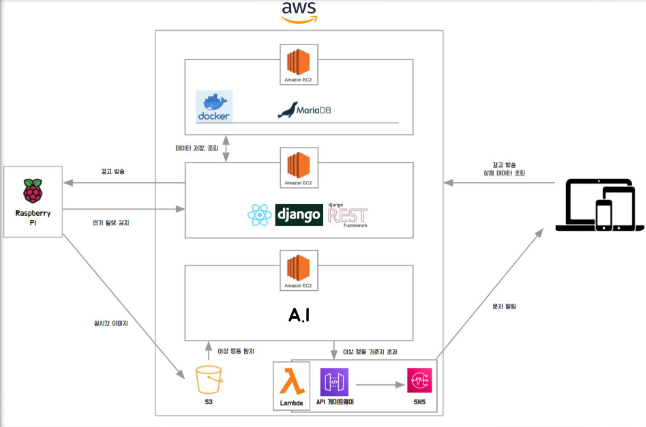
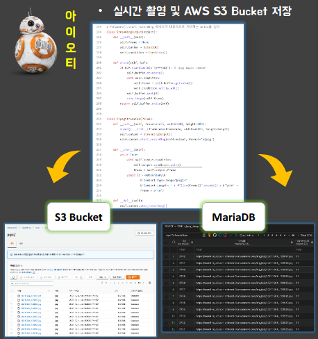
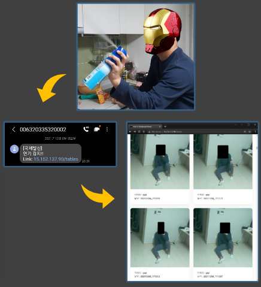
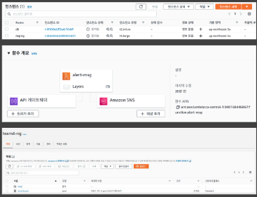
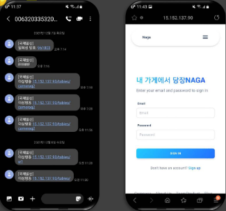
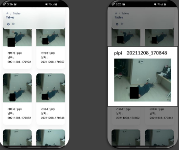

# NAGA

## Table of Contents

[1. 프로젝트 개요](#프로젝트_개요)

[2. 시스템구성도](#시스템구성도)

[3. IoT](#IoT)

[4. AI](#AI)

[5. Cloud](#Cloud)

---

## 프로젝트_개요

NAGA는 이상행동 인식카메라를 이용한 무인상점 보안 웹어플리케이션입니다. 
무인 상점이 활성화 됨에 따라, 관련 사건과 범죄 역시 계속적으로 증가하고 있습니다. 
하지만 상시 근무하는 사람이 없어 빠른 대응이 불가능하며, 예방활동이 제한적이라는 문제점이 있습니다. 
이를 극복하기 위해 프로젝트를 진행하였습니다.

---

## 시스템구성도

- Back-End : Django, 라즈베리파이, MariaDB, AWS S3 Bucket

- Front-End : React

- 알림 서비스 : AWS Lambda, AWS SNS

- AI : AWS EC2

- 배포 : AWS EC2, Nginx

---

## IoT

- 실시간 촬영 및 AWS S3 Bucket 저장

    

- 연기 감지 후 문자 알림 연계

    

---

## AI

YOLO 모델 사용

- Label List

    |Label|Description|
    |-|-|
    |Normal|아무도 없음|
    |Standing|서있는 상태|
    |Sitting|앉은 상태|
    |Lying|누운 상태|

---

## Cloud

- react로 구현한 웹페이지 초기화면
- 회원가입과 로그인 가능
- Dashboard, imgae table, alert 메뉴

- DB와 배포위해 각 EC2 인스턴스 생성
- 이미지 저장위한 s3 bucket
- 알림 메시지 전송위한 람다함수
- 람다함수 호출위한 API Gateway & trigger 추가
- 메세지 전송위한 SNS 주제, 대상 추가

- 알림문자로온 주소로 접속
- 웹에 로그인 안되어잇는경우 로그인 페이지로 이동

- 로그인후 이상행동 목록
- 이미지 클릭 시 상세보기
