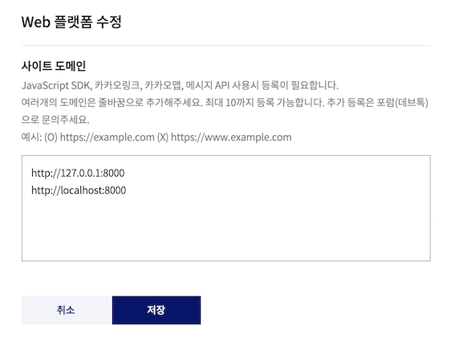

# 카카오 API 설정

1. 아래 링크 접속

    <https://developers.kakao.com/console/app>

2. 애플리케이션 추가

    

    

3. REST API 키 복사해서 back/kakao/secrets.py에 아래와 같이 입력

    

      ```py
      client_id = "여기복사"
      ```

4. 웹 플랫폼 등록 - 일단 테스트니까 본인 ip만 등록, 실제 배포할 때는 AWS IP 등록

    

    

      ```
      http://127.0.0.1:8000
      http://localhost:8000
      ```

5. 카카오 로그인 활성화, Redirect URI 등록

    

    

      ```
      http://127.0.0.1:8000/kakao/oauth
      http://localhost:8000/kakao/oauth
      ```

6. 카톡 메시지 전송 동의

    

    
